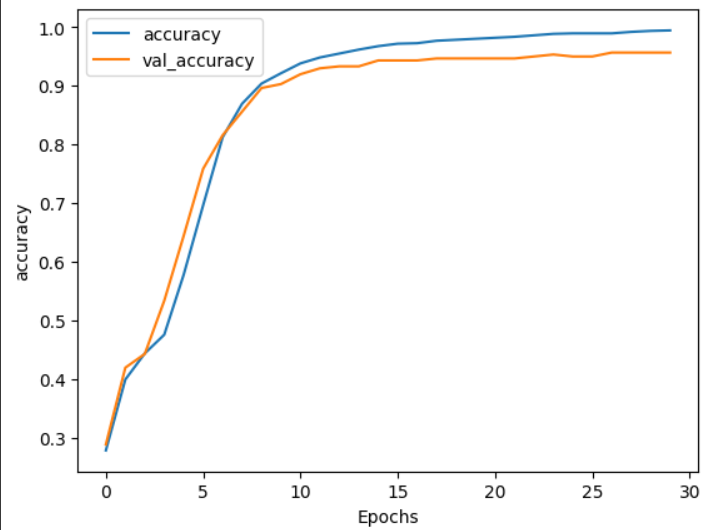
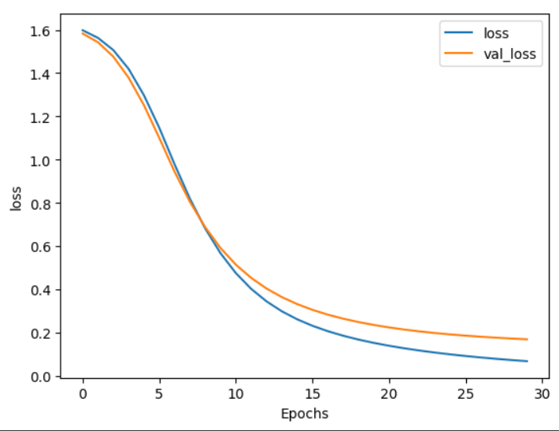

# Text-classifier-using-Embedding-Layer
## AIM
To create a classifier using specialized layers for text data such as Embedding and GlobalAveragePooling1D.

## PROBLEM STATEMENT AND DATASET
The program enables us to classify the given BBC dataset into its respective areas like different categories, for example buisness, sports and tech using Deep learning techniques, which includes loading and preprocessing the data, creating the neural network model, training and evaluation its performance.

## DESIGN STEPS
STEP 1:
Unzip and read the CSV data file. Extract key information and structure it, splitting into training and validation sets and
define vocabulary, embedding dimensions, and sequence length to be used for text processing.

STEP 2:
Standardize the text by removing stopwords and punctuations,
Vectorize the text data using TextVectorization, adapting it to the training set and Encode labels using StringLookup, creating numeric encodings compatible with model input.

STEP 3:
Define the neural network model with an embedding layer and Dense layers for classification, Compile the model, train it on the preprocessed datasets, and evaluate with a validation set and Visualize training metrics (accuracy and loss) across epochs to assess model performance.

Write your own steps

## PROGRAM
### Name:Shaik Shoaib Nawaz
### Register Number:212222240094
```
# Model creation function
def create_model():
    model = tf.keras.Sequential([
        tf.keras.layers.Embedding(VOCAB_SIZE, EMBEDDING_DIM, input_length=MAX_LENGTH),
        tf.keras.layers.GlobalAveragePooling1D(),
        tf.keras.layers.Dense(16, activation='relu'),
        tf.keras.layers.Dense(5, activation='softmax')  # Assuming 5 categories
    ])
    model.compile(loss='sparse_categorical_crossentropy', optimizer='adam', metrics=['accuracy'])
    return model

# Create the model
model = create_model()

# Model evaluation on sample data
example_batch = train_proc_dataset.take(1)
try:
    model.evaluate(example_batch, verbose=False)
except:
    print("Your model is not compatible with the dataset you defined earlier.")
else:
    predictions = model.predict(example_batch, verbose=False)
    print(f"Predictions have shape: {predictions.shape}")

# Model training
history = model.fit(train_proc_dataset, epochs=30, validation_data=validation_proc_dataset)
```
## OUTPUT
### Loss, Accuracy Vs Iteration Plot





## RESULT:
Thus, To create a classifier using specialized layers for text data such as Embedding and GlobalAveragePooling1D is successfully executed.
